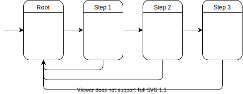

# 🧭 Navigation in SwiftUI

Unidirectional data flow driven navigation for SwiftUI applications

## 📝 Description

This project explores ways to implement navigation in a SwiftUI application, using unidirectional data flow architecture. 

### 🎯 Goals: 

- [x] Navigate between views in a similar way that UIKit allows
  - `NavigationStackView` provides behavior similar to `UINavigationController`
  - `NavigationBackGesture` provides "swipe from edge to go back" behavior known from `UINavigationController`
- [x] Implementation compatible with unidirectional data flow architecture
  - `NavigationItem` provides an interface for a state of a view user can navigate to
  - `[NavigationItem]` array is a single source of truth for `NavigationStackView`
  - `NavigationStackView` can not mutate the state itself
  - State changes are visualized by `NavigationStackView`
- [x] Easily customizable appearance
  - All included views provide a basic implementation that mimics `UINavigationController` look and feel, but can be replaced with any custom view if needed
  - Because no `UINavigationController` is used under the hood, there are no limitations or issues with appearance customizations in contrast to `NavigationView` provided by SwiftUI

### 🧩 Components

Component | Description
:--- | :---
[`NavigationItem`](SwiftUINavigationDemo/Navigation/NavigationItem.swift) | Protocol of a **state model** that represents an item on navigation stack
[`NavigationItemView`](SwiftUINavigationDemo/Navigation/NavigationItemView.swift) | **View** that represents navigation item
[`NavigationItemViewFactory`](SwiftUINavigationDemo/Navigation/NavigationItemViewFactory.swift) | **Function** that creates a view for given navigation item
[`NavigationStackView`](SwiftUINavigationDemo/Navigation/NavigationStackView.swift) | **View** that represents stack of navigation items, as `UINavigationController` does
[`NavigationBarView`](SwiftUINavigationDemo/Navigation/NavigationBarView.swift) | **View** that represents navigation bar
[`NavigationBackButton`](SwiftUINavigationDemo/Navigation/NavigationBackButton.swift) | Back button **view** that can be displayed on navigation bar
[`NavigationBackGesture`](SwiftUINavigationDemo/Navigation/NavigationBackGesture.swift) | **View modifier** that attaches a "swipe from edge to go back" gesture to the navigation item view

### ➡️ Demo app

Simple application with a navigation stack that mimics `UINavigationController` behavior. From initial, root screen user can go to the first step screen. The step screen allows to navigate to the next step (until step number three, which is the last one) or to go back to the root screen.

State of the navigation stack is modeled as an array of navigation items, hold by a store object. Whenever the array changes, view is updated to display top-most navigation item from the stack. User interface is fully customizable, supports **"swipe from edge to go back"** gesture and both **left-to-right** and **right-to-left** layout directions. The implementation provides some default visual style and animations, but those can be easily customized as well. Everything is written in **pure SwiftUI**, without using `UIViewControllerRepresentable` to wrap `UINavigationController`.

Component | Description
:--- | :---
[`Store`](SwiftUINavigationDemo/State/Store.swift) | Simplified implementation of **store object** that holds app's state
[`RootState`](SwiftUINavigationDemo/State/RootState.swift) | **State model** representation of root screen view
[`StepState`](SwiftUINavigationDemo/State/StepState.swift) | **State model** representation of step screen view

View | Description
:--- | :---
[`AppView`](SwiftUINavigationDemo/Views/AppView.swift) | Main **view** of the app containing navigation stack
[`RootView`](SwiftUINavigationDemo/Views/AppView.swift) | Root screen **view**, initial screen of the app
[`StepView`](SwiftUINavigationDemo/Views/AppView.swift) | Step screen **view**

## 🛠 Setup

Requirements:

- [Xcode](https://developer.apple.com/xcode/) 11.3.1

Open `SwiftUINavigation.xcodeproj` in Xcode and run the app.

## 📄 License

Copyright © 2020 [EL Passion](https://www.elpassion.com)

License: [GNU GPLv3](LICENSE)